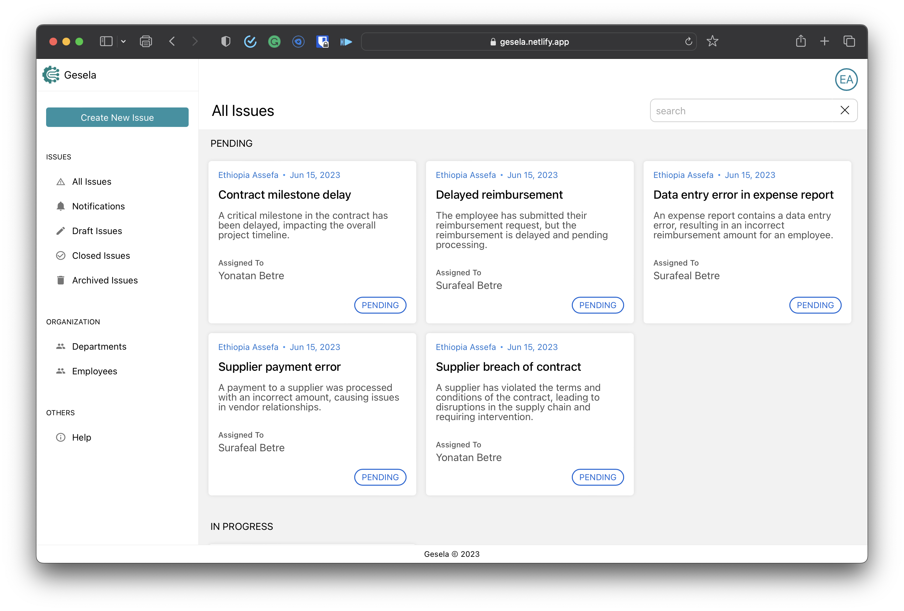
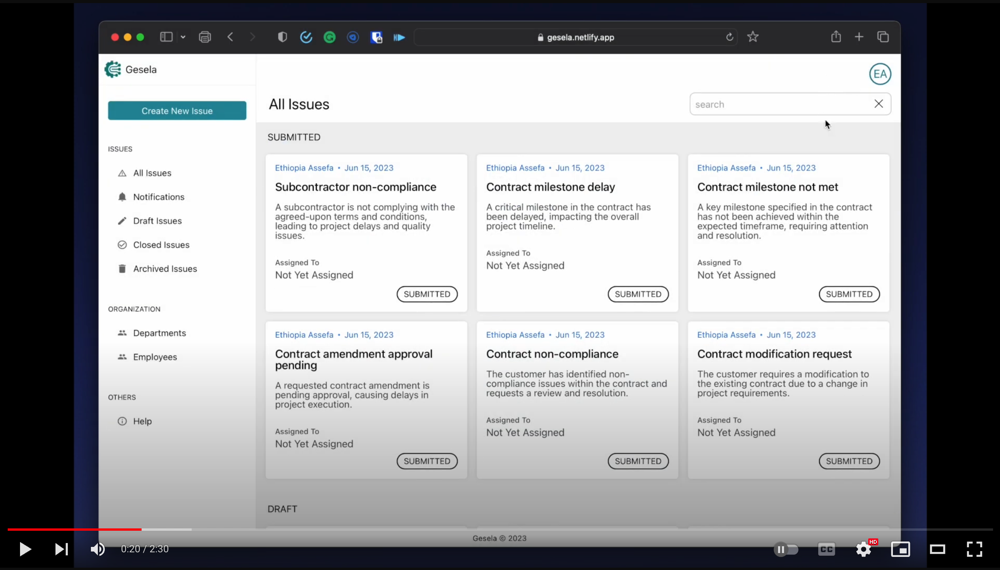

[![Contributors][contributors-shield]][contributors-url]
[![Forks][forks-shield]][forks-url]
[![Stargazers][stars-shield]][stars-url]
[![Issues][issues-shield]][issues-url]
[![MIT License][license-shield]][license-url]
[![LinkedIn][linkedin-shield]][linkedin-url]

<!-- PROJECT LOGO -->
 

  
  <h3 align="center">Gesela</h3></h3>

  

    An Enterprise Issue Tracking and Management Web App
     
     
     
    <a href="https://gesela.netlify.app">View Demo</a>
    ·
    <a href="https://github.com/kalibetre/gesela-api/issues">Report Bug</a>
    ·
    <a href="https://github.com/kalibetre/gesela-api/issues">Request Feature</a>
  

## About The Project

Gesela is an Enterprise Issue Tracking and Management system specifically designed for service-based organizations, with a focus on those in developing countries like Ethiopia.

Its main features are:

-   Allows both customers and employees to create, submit and track issues
-   Allows the organization to manage issues effectively with a role based model (Issue Manager, and Issue Handler)
-   Provides report to the organization to visualize the effectiveness of various departments
-   Provides notifications in each step of the issues life cycle allowing for better transparency

      

---

### Built With

[![Spring Web][spring-boot]][spring-url]

This project is the backend end part of Gesela web app and is built with Spring Web Framework. The frontend of this project is built with ReactJS you can check it out here [Gesela Issue Tracker](https://github.com/kalibetre/gesela-issue-tracker)

## Getting Started

To get a local copy up and running follow these simple example steps.

## Roadmap

-   [ ] Branding customization
-   [ ] Email and SMS notifications
-   [ ] Direct Chat Service
-   [ ] Multi-language Support
    -   [ ] Amharic

See the [open issues](https://github.com/kalibetre/gesela-api/issues) for a full list of proposed features (and known issues).

## Contributing

Contributions are what make the open source community such an amazing place to learn, inspire, and create. Any contributions you make are **greatly appreciated**.

If you have a suggestion that would make this better, please fork the repo and create a pull request. You can also simply open an issue with the tag "enhancement".
Don't forget to give the project a star! Thanks again!

1. Fork the Project
2. Create your Feature Branch (`git checkout -b feature/AmazingFeature`)
3. Commit your Changes (`git commit -m 'Add some AmazingFeature'`)
4. Push to the Branch (`git push origin feature/AmazingFeature`)
5. Open a Pull Request

## License

Distributed under the MIT License. See `LICENSE.txt` for more information.

<!-- CONTACT -->

## Contact

Kalkidan Betre - [@kalibetre](https://twitter.com/kalibetre) - kalbetre@icloud.com

Project Link: [https://github.com/kalibetre/gesela-api](https://github.com/kalibetre/gesela-api)

[contributors-shield]: https://img.shields.io/github/contributors/kalibetre/gesela-api.svg?style=for-the-badge
[contributors-url]: https://github.com/kalibetre/gesela-api/graphs/contributors
[forks-shield]: https://img.shields.io/github/forks/kalibetre/gesela-api.svg?style=for-the-badge
[forks-url]: https://github.com/kalibetre/gesela-api/forks
[stars-shield]: https://img.shields.io/github/stars/kalibetre/gesela-api.svg?style=for-the-badge
[stars-url]: https://github.com/kalibetre/gesela-api/stargazers
[issues-shield]: https://img.shields.io/github/issues/kalibetre/gesela-api.svg?style=for-the-badge
[issues-url]: https://github.com/kalibetre/gesela-api/issues
[license-shield]: https://img.shields.io/github/license/kalibetre/gesela-api.svg?style=for-the-badge
[license-url]: https://github.com/kalibetre/gesela-api/blob/main/LICENSE
[linkedin-shield]: https://img.shields.io/badge/-LinkedIn-black.svg?style=for-the-badge&logo=linkedin&colorB=555
[linkedin-url]: https://www.linkedin.com/in/kalkidan-betre-405750110
[product-screenshot]: images/screenshot.png
[spring-boot]: https://img.shields.io/badge/SpringBoot-6DB33F?style=flat-square&logo=Spring&logoColor=white
[spring-url]: https://spring.io/
